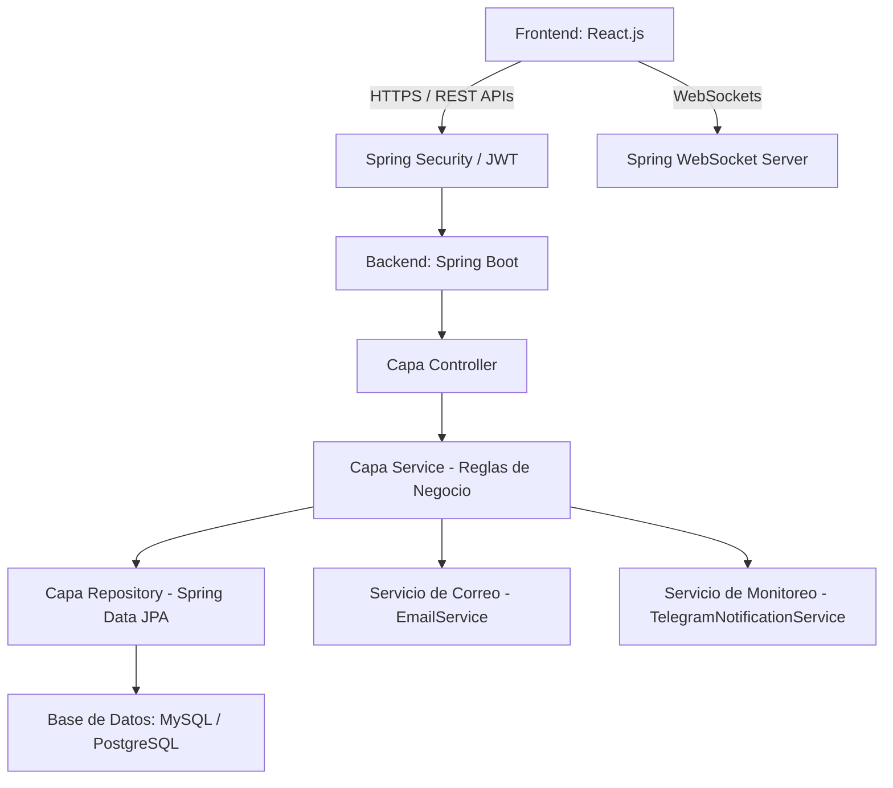

  # 💎 Guía Definitiva de Exposición: Tribu E-commerce
## *Ecosistema Social y Gamificado de Comercio Electrónico*

Esta guía está diseñada para ayudarte a estructurar tu exposición de manera profesional, técnica y segura. Ha sido adaptada con base en la estructura real de tu base de código (Backend en **Spring Boot** y Frontend en **React**).

---

## 🧭 Diapositivas Principales Adaptadas a Nuestro Sistema

### 1. INTRODUCCIÓN
La transformación digital y el comercio social se han convertido en pilares fundamentales para optimizar las transacciones en línea y la fidelización del cliente. Actualmente, el comercio electrónico tradicional enfrenta retos significativos en la retención de usuarios, la ausencia de dinámicas comunitarias y la falta de integración financiera transparente y ágil. Para abordar estas deficiencias, se propone desarrollar un ecosistema interactivo y escalable llamado **Tribu**, que centraliza el comercio gamificado, billeteras digitales P2P, grupos de compra conjunta y árboles de referidos multinivel de manera segura y eficiente, impactando positivamente en la experiencia de compra y retención de todos los actores involucrados.

El sistema integrará un front-end desarrollado en **React.js**, que garantizará una interfaz intuitiva, responsiva y altamente gamificada, junto con un back-end basado en **Spring Boot (Java)** bajo una arquitectura limpia por capas para manejar de forma robusta las reglas de negocio transaccionales. El almacenamiento y consistencia de datos se gestionará mediante **Spring Data JPA y bases de datos relacionales**, complementado con medidas de ciberseguridad avanzadas tales como autenticación de doble factor (2FA), mitigación de ataques de fuerza bruta y saneamiento estricto contra inyecciones.

---

### 2. PLANTEAMIENTO DEL PROBLEMA
En el comercio electrónico tradicional se evidencia la ausencia de canales interactivos y herramientas nativas de compra comunitaria. Los procesos estáticos y sistemas de pago desactualizados impiden la actualización de saldos en tiempo real, el cálculo automatizado de comisiones por referidos y la coordinación de compras grupales para obtener descuentos por volumen. Como resultado, los usuarios no pueden rentabilizar su red de contactos eficientemente, los grupos de amigos tienen dificultades para dividir transacciones de forma nativa en la pasarela de pago y los administradores carecen de herramientas automatizadas para vigilar la seguridad transaccional. Este entorno frío y propenso a fraudes repercute negativamente en la retención del cliente y genera altos costos de adquisición de usuarios (CAC), subrayando la necesidad de implementar un sistema digital gamificado y fintech que optimice la gestión de la información y fortalezca la confianza, comunicación y seguridad de toda la comunidad.

---

### 3. METODOLOGÍA
La metodología se basa en **SCRUM** y se organiza en sprints que abarcan varias etapas fundamentales. Cada sprint incluye reuniones de planificación, seguimiento diario y revisión para garantizar el cumplimiento de los objetivos y la calidad del producto final. El proceso se inicia con el análisis de requisitos comerciales, seguido por el diseño de la arquitectura por capas y el prototipado de la interfaz de usuario en React. Luego se desarrolla tanto el front-end en **React.js** (basado en componentes atómicos y hooks funcionales) como el back-end en **Spring Boot** (conectando controladores, servicios transaccionales y repositorios). Como fase crítica de calidad, se aplican pruebas exhaustivas de concurrencia e inyección de datos (simulando vectores del **OWASP Top 10**) y finalmente se procede al despliegue local y de red del sistema de forma segura.

---

## 2. 🏗️ Arquitectura y Stack Tecnológico
El proyecto se diseñó bajo el paradigma de **desarrollo moderno y desacoplado**:

### 💻 Frontend (React.js)
* **Paradigma Funcional:** Uso exclusivo de hooks funcionales (`useState`, `useEffect`, `useContext`) garantizando un código limpio y mantenible.
* **Componentes Atómicos:** Interfaz modularizada (ej. `BilleteraPage`, `ReferidoArbolPage`, `TribuPassPage`, `MiPerfilPage`).
* **Estado y Reactividad:** Comunicación asíncrona mediante `fetch` (centralizado en `api.js`) y notificaciones de saldo en tiempo real mediante **WebSockets**.
* **Estilo Premium:** Diseño altamente responsivo y compatible con dispositivos móviles, utilizando HSL y gradientes fluidos.

### ⚙️ Backend (Spring Boot - Clean Layered Architecture)
El backend implementa una **Arquitectura Limpia y Organizada por Capas** para separar responsabilidades:
1. **Capa de Modelo (Model/Entities):** Define la estructura de datos (ej. `Usuario`, `Pedido`, `TransferenciaP2P`, `GrupoCompra`, `TribuPass`).
2. **Capa de Repositorio (Repository):** Interfaces que extienden de `JpaRepository` para interactuar con la base de datos de manera segura y eficiente.
3. **Capa de Servicio (Service):** Contiene la lógica y reglas de negocio del sistema (ej. cálculo de comisiones, renovaciones automáticas, balance de saldos).
4. **Capa de Controlador (Controller):** Expone los endpoints REST bajo políticas de autorización estrictas.

---

## 3. 🛠️ ¿Cómo Sirve? Módulos e Innovaciones Clave

### 💸 A. El Motor Fintech (Billetera P2P y Tribu Card)
* **Billetera Digital:** Cada usuario tiene un saldo disponible que puede recargar o usar en compras.
* **Transferencias Peer-to-Peer (P2P):** Permite enviar saldo entre usuarios usando su correo o código de referido.
* **Seguridad Transaccional:** 
  * Se ejecutan en bloques `@Transactional` atómicos.
  * Implementa **bloqueo de fila a nivel de base de datos** (`findByIdForUpdate`) para prevenir ataques de *doble gasto* (double-spending) o condiciones de carrera (race conditions).

### 👥 B. Grupos de Compra Conjunta (Social Split)
* **Dinámica:** Un usuario crea un grupo con un presupuesto (`montoTotal`) y recibe un código único (`TRB-XXXX`).
* **División Automática:** A medida que otros miembros se unen, el sistema calcula de forma dinámica y exacta la fracción correspondiente a cada integrante.
* **Cobro Integrado:** Cada participante paga su porción utilizando su saldo de **Tribu Card**. Cuando el último integrante paga, el estado del grupo cambia automáticamente a `COMPLETADO`.

### 🌳 C. Árbol de Referidos Multinivel
* **Estructura Jerárquica:** El sistema construye recursivamente en profundidad (DFS limitado a 3 niveles de profundidad) el árbol de contactos de un usuario.
* **Distribución de Comisiones:** Cuando un referido realiza una compra, se calcula una comisión diferida para su línea ascendente en tiempo real:
  * **Nivel 1 (Directo):** 5% de la compra.
  * **Nivel 2:** 2% de la compra.
  * **Nivel 3:** 1% de la compra.

### 💎 D. Gamificación Extrema (Tribu Pass & Streaks)
* **Tribu Pass:** Un sistema de suscripción mensual ($9.900 COP) que otorga beneficios automáticos: multiplicador de Cashback x2, envío gratis ilimitado, acceso exclusivo y anticipado a ventas flash.
* **Rachas (Streaks) y Logros:** Fomenta la retención diaria del usuario mediante recompensas acumulativas.

---

## 4. 🛡️ Ciberseguridad Aplicada (OWASP Top 10)
Este proyecto no solo destaca por sus funcionalidades, sino por la **rigurosidad de sus controles de seguridad backend y frontend**:

| Tipo de Riesgo | Medida de Seguridad Implementada en Tribu | Detalle Técnico en el Código |
| :--- | :--- | :--- |
| **A01:2021 - Broken Access Control** | Control de Acceso Basado en Roles (RBAC) y Seguridad JWT | Endpoints administrativos protegidos con anotaciones `@PreAuthorize("hasRole('ADMIN')")`. |
| **A03:2021 - Injection (SQLi / XSS)** | ORM (Spring Data JPA) y Saneamiento de Entradas | Consultas precompiladas que evitan SQL injection. Uso de `HtmlUtils.htmlEscape()` en textos de transferencias para neutralizar ataques XSS. |
| **A07:2021 - Identification & Auth Failures** | Protección Antifuerza Bruta e Integración de 2FA | Bloqueo automático de IP por 15 minutos al acumular 5 fallos en `SecurityAuditService`. Implementación de **TOTP (MFA)** con generación de QR en servidor. |
| **Fuga de Secretos** | Aislamiento de Entorno | Credenciales y llaves criptográficas configuradas estrictamente mediante variables de entorno en archivo `.env` (excluido de Git). |
| **Auditoría Inmutable** | Registro de Eventos Críticos | Tabla `SecurityEvent` que registra de manera inmutable acciones administrativas críticas (ej. cuarentenas, revocación global de sesiones). |

---

## 5. 🧑‍🏫 Simulación de Preguntas de los Profesores (Q&A)

### ❓ Pregunta 1 (Arquitectura / Base de Datos)
> **Profesor:** *"Veo que los usuarios pueden transferir dinero entre sí y que el saldo se actualiza al instante. ¿Cómo garantizan que si dos transferencias ocurren exactamente al mismo milisegundo desde la misma cuenta, no se duplique el saldo o se sobregire la cuenta?"*

**💡 Respuesta Ideal:**
"Excelente pregunta, profesor. Para solucionar este problema implementamos dos mecanismos robustos:
1. **Bloqueo Pesimista (Row-level Locking):** En `TransferenciaService`, al recuperar el usuario emisor no usamos una consulta común, sino que ejecutamos `usuarioRepo.findByIdForUpdate(id)`. Esto genera un bloqueo de fila a nivel de base de datos (`SELECT ... FOR UPDATE`), obligando a que cualquier otra transacción concurrente que intente leer o escribir sobre ese emisor tenga que esperar a que la primera termine.
2. **Atomicidad Transaccional:** Todo el método está marcado con `@Transactional` de Spring. Si por alguna razón la deducción del saldo falla o la acreditación al receptor se interrumpe, el sistema realiza un *rollback* completo al estado anterior de la base de datos, garantizando que el dinero nunca quede en el limbo."

---

### ❓ Pregunta 2 (Algoritmia / Rendimiento)
> **Profesor:** *"El árbol de referidos puede crecer de forma exponencial. Si un usuario tiene miles de referidos en su red, ¿cómo evitan que el servidor colapse al calcular el árbol jerárquico y las comisiones?"*

**💡 Respuesta Ideal:**
"Para mitigar problemas de rendimiento por crecimiento exponencial, tomamos decisiones de diseño clave en `ReferidoTreeService`:
1. **Límite de Profundidad en DFS (Depth-First Search):** El método `construirNodo` realiza una búsqueda en profundidad recursiva, pero está estrictamente acotado a un nivel máximo de **3 niveles de profundidad** (`maxNivel = 3`). El sistema ignora los niveles inferiores durante la visualización del árbol inmediato.
2. **Cálculos Diferidos:** Las ganancias y comisiones se calculan en base a consultas agregadas de compras del mes actual (`calculateTotalEntregadoEnPeriodo`) y no recorriendo transacciones una a una en memoria. Para redes masivas en producción, este esquema se puede optimizar aún más migrando el cálculo de comisiones a un proceso batch en segundo plano (Scheduler) o usando bases de datos orientadas a grafos."

---

### ❓ Pregunta 3 (Seguridad / Ciberseguridad)
> **Profesor:** *"En la sección de transferencias P2P, los usuarios pueden adjuntar un mensaje personalizado. ¿Qué medidas tomaron para evitar que un usuario malintencionado inyecte un código JavaScript en ese mensaje y ejecute un ataque XSS en la pantalla del receptor?"*

**💡 Respuesta Ideal:**
"La seguridad es un pilar fundamental en este proyecto. Para evitar ataques de Cross-Site Scripting (XSS) mediante mensajes maliciosos:
1. **Saneamiento de Entradas en Backend:** En `TransferenciaService`, antes de registrar el mensaje en la base de datos, ejecutamos:
   `String mensajeSaneado = HtmlUtils.htmlEscape(mensaje);`
   Esto codifica caracteres especiales como `<` y `>` convirtiéndolos en sus entidades HTML seguras (`&lt;` y `&gt;`). De esta forma, el navegador del receptor interpretará el código como simple texto plano y nunca lo ejecutará.
2. **Validación en Frontend:** Adicionalmente, el frontend en React por diseño no evalúa HTML crudo dentro de las variables a menos que se use explícitamente `dangerouslySetInnerHTML`, lo cual evitamos estrictamente en todo el proyecto."

---

### ❓ Pregunta 4 (Seguridad / 2FA)
> **Profesor:** *"¿Cómo implementaron la autenticación de dos factores (2FA) y por qué decidieron generar el código QR en el servidor en lugar del cliente?"*

**💡 Respuesta Ideal:**
"Implementamos 2FA utilizando el algoritmo **TOTP (Time-based One-time Password - RFC 6238)**, lo que lo hace compatible con herramientas universales como Google Authenticator o Authy.
Decidimos generar la imagen QR en el servidor (`TwoFactorService.generarQrBase64`) y entregarla codificada en Base64 al cliente por una razón crítica de ciberseguridad: **para no exponer el secreto criptográfico (la semilla TOTP) en la URL del lado del cliente**. Si generáramos el QR en el frontend usando librerías de JavaScript del navegador, tendríamos que transferir la semilla limpia a través de la memoria del navegador, exponiéndola a posibles ataques de secuestro de variables o inspección del DOM. Al procesarlo en el servidor con la librería ZXing, el cliente solo recibe la imagen final PNG segura."

---

### ❓ Pregunta 5 (Lógica de Negocio / Gamificación)
> **Profesor:** *"El Tribu Pass tiene renovación automática. ¿Cómo gestionan esta tarea en segundo plano en Spring Boot si el usuario no tiene la aplicación abierta en ese momento?"*

**💡 Respuesta Ideal:**
"La automatización de procesos en segundo plano se maneja mediante tareas programadas de Spring (`@Scheduled` en nuestra capa de Scheduler, específicamente en coordinadores como `AdminSchedulerController`). 
El sistema corre un hilo periódico que busca todos los registros de `TribuPass` con `estado = ACTIVA`, `renovacionAutomatica = true` y cuya `fechaRenovacion` sea menor o igual al momento actual. Para cada uno, el backend ejecuta el método `procesarRenovacion` en `TribuPassService`: descuenta el valor mensual del saldo real del usuario, extiende la fecha por 30 días y le envía un correo electrónico informativo con el recibo. Si el usuario no cuenta con saldo suficiente, la suscripción se marca automáticamente como `EXPIRADA` de forma segura y se le notifica por correo electrónico."

---

### ❓ Pregunta 6 (Arquitectura de Frontend)
> **Profesor:** *"¿Cómo manejan la reactividad y las actualizaciones del estado en el cliente cuando ocurren eventos de red o cambios de saldo?"*

**💡 Respuesta Ideal:**
"Para mantener la consistencia de datos y una experiencia fluida sin saturar el servidor con peticiones HTTP repetitivas (polling), implementamos un sistema híbrido:
1. **React Context:** Para propagar información global del usuario (como datos de perfil y autenticación) a todos los componentes de la interfaz de manera limpia.
2. **WebSockets:** Para eventos altamente dinámicos como las actualizaciones de saldo o las transferencias entrantes. Contamos con un servicio de WebSocket en el cliente que escucha canales específicos (`/topic/saldo` y `/topic/transferencias`). Cuando el backend procesa una transacción, emite un mensaje al canal del usuario y el frontend actualiza inmediatamente el estado local de React, lo que gatilla una renderización instantánea y limpia de la interfaz."

---

## 🧭 Diapositiva Extra: RECOMENDACIONES FUTURAS

Para garantizar el crecimiento, la resiliencia técnica y la expansión comercial del ecosistema **Tribu**, se proponen las siguientes líneas de trabajo y recomendaciones futuras para el desarrollo del software:

1. **Migración Progresiva hacia Microservicios (Escalabilidad de Infraestructura):** 
Con el fin de evitar cuellos de botella por alta concurrencia de transacciones simultáneas y compras grupales, se recomienda desacoplar la arquitectura monolítica actual. Esto implica separar el **módulo core de e-commerce**, el **motor fintech (saldos y transferencias P2P)** y el **motor de gamificación (Tribu Pass)** en microservicios independientes e interconectados mediante un API Gateway de Spring Cloud y colas de mensajería asíncronas con Apache Kafka.

2. **Integración con Inteligencia Artificial Avanzada para Recomendaciones:** 
Optimizar el controlador básico de recomendaciones migrando hacia un motor de Machine Learning basado en filtrado colaborativo y aprendizaje profundo. Este módulo procesará en tiempo real el historial de compras individuales, las interacciones en los grupos de compra y las preferencias de los usuarios conectados a través del árbol de referidos multinivel, entregando sugerencias de productos hiperpersonalizadas para aumentar el ticket promedio.

3. **Fortalecimiento de la Inteligencia de Amenazas y GeoIP Real:** 
Enriquecer el Centro de Control de Seguridad Administrativa integrando de manera nativa librerías de geolocalización IP (como MaxMind GeoIP2) y servicios web de reputación IP (como AbuseIPDB). Esto permitirá geolocalizar con precisión geográfica en tiempo real el origen de los accesos fallidos y habilitar bloqueos automáticos dinámicos (IP Banning) a través del firewall o WAF de producción al detectar patrones anómalos de fuerza bruta.

4. **Transición Financiera a Tecnología Web3 y Tokenización:** 
Explorar la descentralización del sistema de fidelización de Tribu Pass mediante la tokenización de puntos y cashback sobre una red blockchain de segunda capa (Layer 2) como Arbitrum o Polygon. Esto garantizará una transparencia matemática absoluta en la distribución de comisiones en el árbol de referidos y permitirá a los usuarios intercambiar sus beneficios en mercados descentralizados abiertos.

5. **Conexión de Pasarelas de Pago Reales:** 
Sustituir el entorno simulado de compras con saldo por integraciones directas con pasarelas de pago reales y certificadas bajo la norma PCI-DSS (como Stripe o MercadoPago) a través de Webhooks cifrados, manteniendo controles estrictos de tokens CSRF y firmas criptográficas para resguardar cada transacción.
